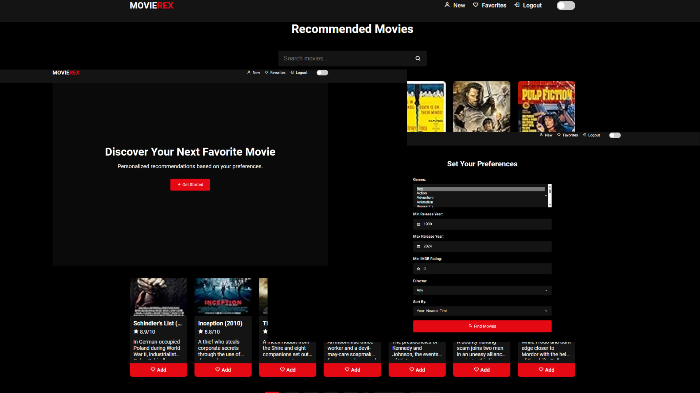

# MovieReX



**MovieReX** is a sophisticated **Movie Recommender System** built with **Python Flask**, **SQLite**, and **Bootstrap**. Designed to deliver personalized movie recommendations, MovieReX allows users to register, set their movie preferences, rate movies, and curate a favorites list. With features like an interactive star rating system, real-time search filtering, and responsive design, MovieReX ensures an engaging and seamless user experience.

## Table of Contents

- [Features](#features)
- [Prerequisites](#prerequisites)
- [Installation](#installation)
- [Running the Application](#running-the-application)
- [Usage](#usage)
- [Project Structure](#project-structure)
- [Contributing](#contributing)
- [License](#license)
- [Virtual Environment Setup](#virtual-environment-setup)
- [Dataset Source](#dataset-source)

---

## Features

- **User Authentication**: Secure registration and login system.
- **User Preferences**: Customize preferences including genres, release year range, minimum IMDB rating, and director.
- **Interactive Star Rating System**: Rate movies using an intuitive and visually appealing star interface.
- **Release Date Display**: View the release year directly beside each movie title for quick reference.
- **Movie Recommendations**: Receive personalized recommendations based on your specified preferences.
- **Pagination**: Navigate through multiple pages of movie recommendations with efficient pagination controls.
- **Real-time Search Filtering**: Instantly filter displayed movies as you type in the search box.
- **Favorites List**: Add movies to a favorites list for easy access and management.
- **Detailed Movie Pages**: Access comprehensive information about each movie, including overview, cast, and user ratings.
- **Toaster Notifications**: Receive non-intrusive, real-time notifications for authentication, favorites, and rating actions using Toastr.
- **Responsive Design**: Enjoy a sleek and minimalistic flat UI design that adapts seamlessly to various screen sizes.

---

## Prerequisites

- **Python 3.7 or higher**
- **pip** (Python package installer)
- **Git** (optional, for cloning the repository)

---

## Installation

### 1. Clone the Repository

You can clone this repository using Git or download the ZIP file.

```bash
git clone https://github.com/KCprsnlcc/MovieRecommender.git
cd MovieRecommender
```

### 2. Set Up a Python Virtual Environment

It is recommended to use a virtual environment to manage dependencies. You can use `venv`, which comes with Python 3.

#### On Windows:

```bash
# Create virtual environment
python -m venv .venv

# Activate virtual environment
.venv\Scripts\activate
```

#### On macOS and Linux:

```bash
# Create virtual environment
python3 -m venv .venv

# Activate virtual environment
source .venv/bin/activate
```

### 3. Install Dependencies

With the virtual environment activated, install the required Python packages:

```bash
pip install -r requirements.txt
```

*If `requirements.txt` does not exist, create it with the following content:*

```text
Flask
Werkzeug
pandas
```

Install the packages:

```bash
pip install Flask Werkzeug pandas
```

### 4. Prepare the Dataset

Place your `movies.csv` file in the project directory. Ensure the CSV file is properly formatted with the following columns:

- `Poster_Link`
- `Series_Title`
- `Released_Year`
- `Certificate`
- `Runtime`
- `Genre`
- `IMDB_Rating`
- `Overview`
- `Meta_score`
- `Director`
- `Star1`
- `Star2`
- `Star3`
- `Star4`
- `No_of_Votes`
- `Gross`

*Example of `movies.csv`:*

```csv
Poster_Link,Series_Title,Released_Year,Certificate,Runtime,Genre,IMDB_Rating,Overview,Meta_score,Director,Star1,Star2,Star3,Star4,No_of_Votes,Gross
https://link1.jpg,The Shawshank Redemption,1994,A,142 min,Drama,9.3,"Two imprisoned men bond over a number of years...",80,Frank Darabont,Tim Robbins,Morgan Freeman,Bob Gunton,William Sadler,2343110,28341469
https://link2.jpg,The Godfather,1972,A,175 min,Crime, Drama,9.2,"An organized crime dynasty's aging patriarch...",100,Francis Ford Coppola,Marlon Brando,Al Pacino,James Caan,Diane Keaton,1620367,134966411
```

### 5. Import the Data

Run the `import_data.py` script to create the SQLite database and import the movie data.

```bash
python import_data.py
```

---

## Running the Application

With the virtual environment activated and dependencies installed, you can run the Flask application.

```bash
python app.py
```

The application will start on `http://127.0.0.1:5000/`. Open this URL in your web browser to access MovieReX.

---

## Usage

1. **Register**: Create a new user account by clicking on the "Register" link.
2. **Login**: Log in with your username and password.
3. **Set Preferences**: On the home page, set your movie preferences and click "Find Movies".
4. **Browse Movies**: View recommended movies, use pagination controls to navigate, and search to filter movies.
5. **View Details**: Click on a movie to view detailed information.
6. **Rate Movies**: Rate movies on their detail pages using the interactive star rating system.
7. **Manage Favorites**: Add movies to your favorites list for easy access.
8. **Logout**: Click "Logout" in the navigation bar to end your session.

---

## Project Structure

```
MovieRecommender/
│
├── app.py                   # Main Flask application
├── import_data.py           # Script to import movie data into SQLite database
├── movies.db                # SQLite database file (created after running import_data.py)
├── movies.csv               # CSV file containing movie data (you need to provide this)
├── requirements.txt         # Python dependencies
├── templates/
│   ├── base.html            # Base HTML template
│   ├── index.html           # Home page template
│   ├── login.html           # Login page template
│   ├── register.html        # Registration page template
│   ├── favorites.html       # Favorites page template
│   └── movie_detail.html    # Movie detail page template
├── static/
│   ├── styles.css           # CSS styles
│   └── scripts.js           # JavaScript scripts
└── screenshots/
    └── homepage.png         # Screenshot for GitHub preview
```

---

## Contributing

Contributions are welcome! Please follow these steps:

1. Fork the repository.
2. Create a new branch: `git checkout -b feature-name`.
3. Commit your changes: `git commit -am 'Add new feature'`.
4. Push to the branch: `git push origin feature-name`.
5. Submit a pull request.

---

## License

This project is licensed under the MIT License - see the [LICENSE](LICENSE) file for details.

---

## Virtual Environment Setup

### What is a Virtual Environment?

A Python virtual environment is an isolated environment that allows you to install packages and dependencies specific to a project without affecting the global Python installation. This ensures that projects are independent and helps prevent version conflicts between packages.

### Setting Up a Virtual Environment

#### 1. Ensure Python is Installed

Make sure you have Python 3.7 or higher installed on your system. You can check your Python version by running:

```bash
python --version
```

or

```bash
python3 --version
```

#### 2. Create a Virtual Environment

Navigate to your project directory:

```bash
cd path/to/MovieRecommender
```

Create a virtual environment named `venv`:

##### On Windows:

```bash
python -m venv venv
```

##### On macOS and Linux:

```bash
python3 -m venv venv
```

This will create a new directory called `venv` in your project folder, containing the virtual environment.

#### 3. Activate the Virtual Environment

##### On Windows:

```bash
venv\Scripts\activate
```

##### On macOS and Linux:

```bash
source venv/bin/activate
```

After activation, your command prompt or terminal will typically show the name of the virtual environment, indicating that it's active.

#### 4. Install Required Packages

With the virtual environment activated, install the project's dependencies:

```bash
pip install -r requirements.txt
```

If `requirements.txt` is not available, you can install packages individually:

```bash
pip install Flask Werkzeug pandas
```

#### 5. Deactivate the Virtual Environment

When you're done working on the project, you can deactivate the virtual environment:

```bash
deactivate
```

### Benefits of Using a Virtual Environment

- **Isolation**: Keeps project dependencies separate.
- **Consistency**: Ensures that the project runs with the same package versions, avoiding compatibility issues.
- **Manage Multiple Projects**: Allows you to work on multiple projects with different dependencies simultaneously.

### Additional Tips

- **Reproducing Environments**: If you share your project, others can recreate the same environment by creating a virtual environment and installing packages from `requirements.txt`.
- **Updating `requirements.txt`**: If you install new packages, update `requirements.txt`:

  ```bash
  pip freeze > requirements.txt
  ```

- **Checking Active Environment**: To verify that the virtual environment is active, run:

  ```bash
  which python    # macOS/Linux
  where python    # Windows
  ```

  The path should point to the `venv` directory.

---

## Dataset Source

This project utilizes a dataset sourced from the [IMDB Top 1000 Movies Analysis](https://github.com/F-odt/IMDB_Top1000_Movies_Analysis) repository by [F-odt](https://github.com/F-odt).

- **Repository**: [https://github.com/F-odt/IMDB_Top1000_Movies_Analysis](https://github.com/F-odt/IMDB_Top1000_Movies_Analysis)
- **Author**: [F-odt](https://github.com/F-odt)

### Acknowledgment

We sincerely thank **F-odt** for providing the dataset used in this project. The dataset has been instrumental in building and testing MovieReX.

### Dataset License and Usage

Please note that the dataset is subject to the terms and conditions specified by the original author. Before using the dataset, ensure compliance with any licensing agreements or attribution requirements.

---
